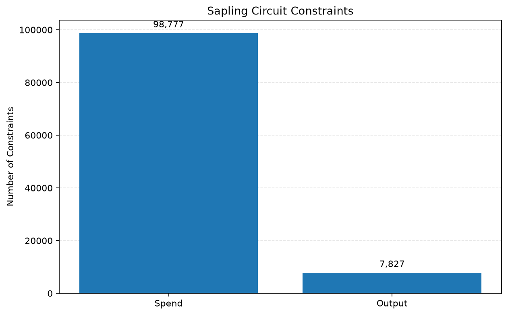
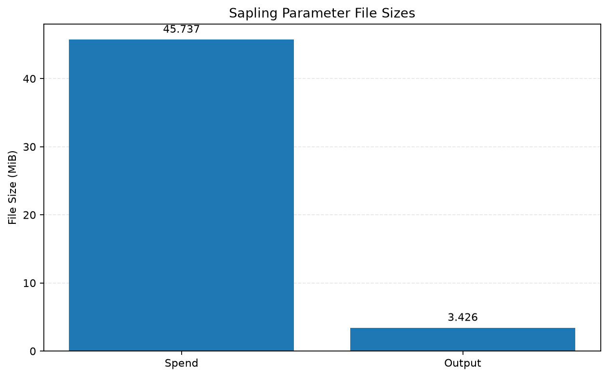
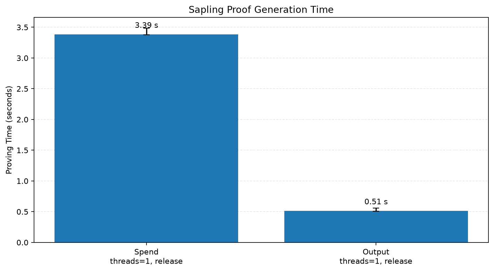

# Zcash Sapling Engineering Study

A reproducible engineering study of the Sapling Groth16 proving workflow used in Zcash. This repository records real Spend and Output circuit scale, parameter-file metadata, proof-generation and verification measurements, the source call path, and exploratory MSM profiling.

> **Status:** The first real-engineering baseline is frozen. The project has not implemented or validated an algorithmic optimization. Some measurement and archival tasks remain open.

- **Frozen snapshot:** [`sapling-engineering-baseline-v1`](https://github.com/kaikai-cao/zcash-sapling-engineering/tree/sapling-engineering-baseline-v1)
- **Frozen commit:** [`281f1882bd1b8347f44f485f0f5dca296edafe08`](https://github.com/kaikai-cao/zcash-sapling-engineering/commit/281f1882bd1b8347f44f485f0f5dca296edafe08)
- **Advisor-facing summary:** [`weekly_summary.md`](weekly_summary.md)
- **Detailed MSM analysis:** [`docs/msm_profiling_notes.md`](docs/msm_profiling_notes.md)

## Baseline snapshot vs. profiling build

The tag [`sapling-engineering-baseline-v1`](https://github.com/kaikai-cao/zcash-sapling-engineering/tree/sapling-engineering-baseline-v1) preserves the frozen source snapshot associated with the formal engineering baseline. Its vendored Bellman MSM implementation does not contain the additional profiling markers now present on `main`.

The designated formal batches are:

| Circuit | Batch ID | Prove median | Verify median | Samples verified | Rayon threads |
|---|---:|---:|---:|---:|---:|
| Spend | `1791613854129` | 3,385.716 ms | 2.790 ms | 5/5 | 1 |
| Output | `1791549582046` | 514.853 ms | 2.150 ms | 5/5 | 1 |

The current `main` branch includes additional Bellman MSM and worker-scheduling instrumentation in `vendor/bellman/src/multiexp.rs`. It records MSM elapsed time, task-start delay, and submit-stage timing. Instrumentation and build state can affect absolute runtime, so timings collected from the profiling-oriented branch must not be treated as direct reproductions of the frozen formal baseline.

To inspect the frozen source snapshot locally, first preserve or commit any local changes, then run from the repository root:

```powershell
git fetch --tags
git switch --detach sapling-engineering-baseline-v1
```

Return to the development branch after inspection with:

```powershell
git switch main
```

Do not switch revisions while you have uncommitted changes that need to be preserved. The frozen tag must not be moved to a newer commit.

## Key figures

The following figures are generated from recorded experiment data. They supplement, but do not replace, the CSV summaries.

### Circuit constraints



Spend has 98,777 constraints, compared with 7,827 for Output. These are different circuits and not equivalent workloads.

### Parameter-file sizes



The Spend parameter file is 45.737 MiB; the Output parameter file is 3.426 MiB. A parameter file contains the encoded proving and verifying parameters for its circuit; its file size must not be described as an independently measured CRS, PK, or VK size. See the [Zcash Sapling protocol specification, §5.8](https://zips.z.cash/protocol/sapling.pdf).

### Formal proof-generation time



Bars show the median Prove time from five measurements per circuit. Error bars show the observed minimum and maximum, not confidence intervals. Because Spend and Output are different circuits, this chart does not establish a general complexity relationship.

## Circuit scale and parameter files

| Metric | Sapling Spend | Sapling Output |
|---|---:|---:|
| Constraints | 98,777 | 7,827 |
| Auxiliary variables | 98,638 | 7,821 |
| Public inputs, excluding constant one | 7 | 5 |
| Input variables, including constant one | 8 | 6 |
| Estimated domain size | 131,072 | 8,192 |
| Parameter-file size | 47,958,396 bytes / 45.737 MiB | 3,592,860 bytes / 3.426 MiB |
| SHA-256 | `8e48ffd23abb3a5fd9c5589204f32d9c31285a04b78096ba40a79b75677efc13` | `2f0ebbcbb9bb0bcffe95a397e7eba89c29eb4dde6191c339db88570e3f3fb0e4` |

Constraint and variable counts were obtained with a counting ConstraintSystem. Domain size is estimated as `next_power_of_two(constraints)` rather than queried directly from the runtime domain object. Full SHA-256 and BLAKE2b-512 digests are recorded in [`results/tables/engineering_parameters.csv`](results/tables/engineering_parameters.csv); the parameter file size and validation evidence are also recorded in [`experiments/metadata/parameter_validation.csv`](experiments/metadata/parameter_validation.csv).

### Obtaining and validating Sapling parameters

The two parameter files are external inputs and are intentionally not committed to this repository. The Zcash protocol specification (§5.8) publishes the expected BLAKE2b-512 digests for these files.

Official download endpoints:

- [`sapling-spend.params`](https://download.z.cash/downloads/sapling-spend.params)
- [`sapling-output.params`](https://download.z.cash/downloads/sapling-output.params)

For the original Windows experiment layout, save the files to `D:\Research\zcash-params\`:

```powershell
$paramsDir = "D:\Research\zcash-params"
New-Item -ItemType Directory -Path $paramsDir -Force | Out-Null

Invoke-WebRequest `
    -Uri "https://download.z.cash/downloads/sapling-spend.params" `
    -OutFile "$paramsDir\sapling-spend.params"

Invoke-WebRequest `
    -Uri "https://download.z.cash/downloads/sapling-output.params" `
    -OutFile "$paramsDir\sapling-output.params"
```

Expected file sizes:

| File | Expected bytes | Approximate size |
|---|---:|---:|
| `sapling-spend.params` | 47,958,396 | 45.737 MiB |
| `sapling-output.params` | 3,592,860 | 3.426 MiB |

After download, validate the files before running experiments:

```powershell
python scripts/verify_params.py
```

The script checks expected sizes and the published BLAKE2b-512 digests, then writes the result to `experiments/metadata/parameter_validation.csv`. The harness also has its own parameter-loading and point-encoding validation path; those timings are distinct from the formal Prove measurements.

## Formal proof and verification baseline

The formal summary selects only the designated release-mode batches above. Each batch contains five measurements; `RAYON_NUM_THREADS=1` was used for the formal baseline.

| Metric | Spend | Output |
|---|---:|---:|
| Prove median | 3,385.716 ms | 514.853 ms |
| Prove minimum / maximum | 3,377.138 / 3,484.750 ms | 507.096 / 560.162 ms |
| Verify median | 2.790 ms | 2.150 ms |
| Verify minimum / maximum | 2.775 / 2.797 ms | 2.102 / 2.195 ms |
| Encoded proof size | 192 bytes | 192 bytes |
| Successful proof checks | 5/5 | 5/5 |

The Prove timer excludes parameter loading, verifying-key preparation, and witness/input construction. Verify measures the experiment's Sapling proof-check API call, not end-to-end transaction or consensus validation. In particular, the Spend check includes related input and authorization-signature checks; it is not an isolated pairing-only microbenchmark.

The designated summary is [`results/tables/engineering_performance.csv`](results/tables/engineering_performance.csv). Raw runs are preserved under `experiments/raw/csv/`; the summary script selects only the specified formal batch IDs so exploratory runs are not silently mixed into the baseline.

## Memory measurement and limitations

| Metric | Spend | Output |
|---|---:|---:|
| Peak working set | 101.31 MiB | 22.22 MiB |
| Independent process samples | 1 | 1 |

These values were collected from Windows `Process.PeakWorkingSet64` at 250 ms polling intervals. They represent whole-process peak working set across parameter loading, validation, proving, and verification; they are not Prove-only memory measurements. With one observation per circuit, they do not establish memory variability or a stable distribution. See [`results/tables/engineering_memory.csv`](results/tables/engineering_memory.csv).

A controlled cold-versus-warm benchmark has not been completed. The available first-versus-repeat runs did not clear the operating-system file cache and are exploratory observations only. Runtime variation was observed, but its cause has not been established.

## What the profiling supports

- **Output, single thread:** Two lower-overhead profiles found that the sum of the eight MSM-call elapsed times accounted for about 93.2%–93.4% of Prove in subsequent runs. This supports MSM being a dominant cost in the measured Output path; it does not establish the same share for all circuits or for Spend.
- **Output, B-G2 auxiliary:** This was the slowest individual call among the eight mapped MSM calls, with a lower-overhead profile-size median of about 152.731 ms. A deeper-instrumentation run attributed about 70.11% of that call's summed internal elapsed timing to bucket fill. These internal timings are affected by instrumentation and do not imply an equivalent end-to-end speedup opportunity.
- **Spend, exploratory:** Batch `1791634015130` produced a five-run Prove median of 8,020.464 ms, with a median ratio of summed MSM-call elapsed times to Prove of 87.62%. All five proofs verified. This was collected using heavily instrumented code in a separate worktree and does not replace the formal uninstrumented Spend result of 3,385.716 ms. The profile and its raw log should be interpreted with its exact source-difference record and batch metadata.
- **Thread experiments:** Two separate Output datasets measured median Prove changes from 1 to 20 threads of 514.784 to 78.851 ms (6.53×) and 512.951 to 89.835 ms (5.71×). These are separate measurement batches and must not be combined into a universal speedup claim. One exploratory Spend batch per thread configuration is not enough to identify a generally optimal thread count.
- **Worker scheduling:** Single-thread logs show a large submit-stage delay associated with the Spend B-G1 auxiliary call and a synchronous-fallback pattern in Output experiments. These are scheduling-path clues, not a proven root cause. MSM timers overlap in multithreaded runs and must not be summed to estimate MSM's share of whole-Prove time.

Detailed analysis, tables, and caveats are in [`docs/baseline_comparison.md`](docs/baseline_comparison.md) and [`docs/msm_profiling_notes.md`](docs/msm_profiling_notes.md). The latter separates Output and Spend exploratory profiling from the formal baseline.

## Zcash Sapling call path and scope

[`docs/zcash_sapling_flow.md`](docs/zcash_sapling_flow.md) documents the principal source path from wallet transaction construction through the transaction Builder and Sapling bundle, to `SpendProver` / `OutputProver` and Groth16 proof generation. It also outlines the Spend/Output proof-check APIs.

The benchmark harness calls proving and proof-check APIs directly. It does **not** time the full wallet `Builder::build(...)` flow, transaction serialization, authorization/signing, network propagation, or all consensus checks. The reported times are therefore measurements of selected Sapling proving and verification operations, not end-to-end Zcash transaction latency.

## Repository map

This is a high-level map of the committed project layout; data and profiling records are organized by purpose rather than listed exhaustively.

```text
zcash-sapling-engineering/
├── README.md
├── weekly_summary.md
├── docs/
│   ├── baseline_comparison.md
│   ├── engineering_experiment_notes.md
│   ├── msm_profiling_notes.md
│   ├── smoke-check.md
│   └── zcash_sapling_flow.md
├── experiments/
│   ├── prover-smoke/
│   │   ├── Cargo.toml
│   │   ├── Cargo.lock
│   │   └── src/bin/
│   ├── metadata/                    # parameter checks and profiling metadata
│   └── raw/
│       ├── csv/                     # raw measurements and per-run records
│       └── logs/                    # preserved experiment logs
├── results/
│   ├── figures/                     # generated charts
│   └── tables/                      # derived summaries and profile mappings
├── scripts/                         # validation, aggregation, plotting, profiling
├── vendor/
│   ├── bellman/                     # vendored source; main contains profiling instrumentation
│   └── groth16/                     # vendored Groth16 source
└── .gitignore
```

- `experiments/raw/` preserves original logs and structured measurements; do not delete outliers simply to make results appear cleaner.
- `results/tables/` contains derived summaries. The formal performance table is `engineering_performance.csv`; profile-specific tables remain separate.
- `results/figures/` contains charts generated from recorded data.
- `scripts/summarize_engineering.py` regenerates the principal engineering tables and seven summary figures from existing data; it does not run proving experiments.
- `scripts/verify_params.py` checks external parameter files by expected file size and BLAKE2b-512 digest.
- Profile logs and outputs should be paired with the source revision, instrumentation state, batch ID, curve/circuit, build profile, and thread configuration.

## Reproducing measurements

### Prerequisites and source checkout

The original measurement environment was Windows 11, Intel Core i7-14700, 32 GB RAM, Rust 1.98.1 for the local harness, Release build, BLS12-381, and Groth16. The external Sapling source checkout used `sapling-crypto` 0.9.0 at commit `88a7946b4a3066787776e11f0a502654167e022d`.

For the original Windows layout, the engineering repository, Sapling source checkout, and parameter files are expected at:

- `D:\Research\zcash-sapling-engineering`
- `D:\Research\zcash-sapling-crypto`
- `D:\Research\zcash-params\sapling-spend.params`
- `D:\Research\zcash-params\sapling-output.params`

From `D:\Research`, the source checkout can be prepared as follows. If the directories already exist, check their state first rather than overwriting local work.

```powershell
if (-not (Test-Path .\zcash-sapling-engineering)) {
    git clone https://github.com/kaikai-cao/zcash-sapling-engineering.git zcash-sapling-engineering
}
if (-not (Test-Path .\zcash-sapling-crypto)) {
    git clone https://github.com/zcash/sapling-crypto.git zcash-sapling-crypto
}
Set-Location .\zcash-sapling-crypto
git checkout 88a7946b4a3066787776e11f0a502654167e022d
Set-Location ..\zcash-sapling-engineering
```

The recorded upstream `sapling-crypto` smoke-test environment used Rust/Cargo 1.88.0; the local engineering harness was recorded with Rust 1.98.1. The harness uses path dependencies to the external Sapling checkout and vendored `bellman` / `groth16` source. The `main` branch has profiling instrumentation, so it must not be mistaken for the frozen uninstrumented baseline.

### Commands

Run from the engineering repository root in PowerShell. These commands can run experiments or append raw records; inspect the batch IDs and source revision before running them. Validate parameter files first.

```powershell
$env:RAYON_NUM_THREADS = "1"

# Validate external parameter files and hashes
python scripts/verify_params.py

# Circuit constraints and variable counts
cargo run --release --manifest-path experiments/prover-smoke/Cargo.toml --bin circuit_scale

# Parameter metadata and point-encoding checks
cargo run --release --manifest-path experiments/prover-smoke/Cargo.toml --bin parameter_metadata

# Spend proof generation and verification
cargo run --release --manifest-path experiments/prover-smoke/Cargo.toml --bin spend_prover_smoke

# Output proof generation and verification
cargo run --release --manifest-path experiments/prover-smoke/Cargo.toml --bin sapling-output-smoke

# Rebuild principal tables and figures from recorded data only
python scripts/summarize_engineering.py
```

`python scripts/summarize_engineering.py` regenerates derived summaries and charts but does not run new proof experiments. Proving commands may append new rows to raw CSV files. Do not rerun proving merely to regenerate an existing summary, and do not mix new exploratory batches into the designated formal baseline.

## Current limitations and next steps

- Complete a controlled cold-versus-warm measurement protocol; current first-versus-repeat observations are not a strict cache benchmark.
- Repeat peak-working-set measurements to characterize variability; current figures are one whole-process observation per circuit.
- If extending the exploratory Spend profile, use a committed clean experiment revision and record the source revision, parameter hashes, build profile, thread count, batch ID, and timing boundaries.
- For future measurements, record the engineering commit/worktree revision, Sapling source commit, parameter hashes, build profile, thread count, batch ID, and timing boundaries.
- If an optimization is eventually implemented, report both the local stage change and end-to-end Prove change, along with any costs or regressions elsewhere.

No algorithmic optimization has been implemented or validated. Current profiling identifies candidate cost and scheduling paths; it does not demonstrate optimization gains.
